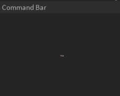

## Why does the script not load?

!!! example "File Corruption"
	1. Go into the folder where your executor is located
	2. Look for a folder named `workspace`
	3. Go into the folder named `workspace`
	4. Find the file named `IY_FE.iy` and delete it
	5. Join a game and execute Infinite Yield
	
	This will delete all your saved Infinite Yield settings (Prefix, Waypoints, etc.)
